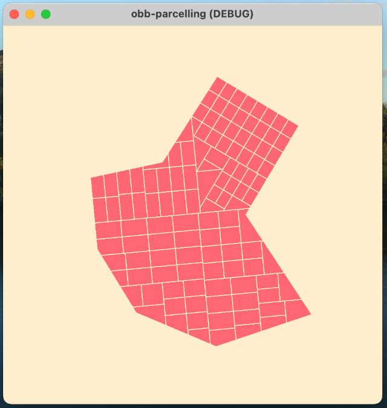

# OBB (Object Aligned Bounding Box) Parcelling
A Godot implementation of OBB (Object Aligned Bounding Box) Parcelling to procedurally generate parcels of city blocks.

## Installation
Clone or save this repo locally ([instructions](https://docs.github.com/en/repositories/creating-and-managing-repositories/cloning-a-repository)), and then import it using Godot's [project manager](https://docs.godotengine.org/en/stable/tutorials/editor/project_manager.html).
## Usage
Within Godot, run the scene by pressing the Play Scene button in the top-right of the screen or press F6 (Cmd + R on macOS).
Every time the scene is run, a new parcel is randomly created. To get a new parcel, you can press the "R" key or the "Enter" button on the scene window to rerun the scene. The main logic can be found in the script associated with the parent node, Node2D. The program can be configured by modifying the values found in the inspector tab with the parent node selected. To register changes, press the "Tab" button on your keyboard after modifying an inspector field. Then save the changes and rerun the project.
## Credits
* This project was inspired by "[Procedural Generation of Parcels in Urban Modeling](https://www.cs.purdue.edu/cgvlab/papers/aliaga/eg2012.pdf)"
by Carlos A. Vanegas, Tom Kelly, Basil Weber, Jan Halatsch, Daniel G. Aliaga, and Pascal Müller.
* I found this paper by reading Martin Evans's [blogpost](https://martindevans.me/game-development/2015/12/27/Procedural-Generation-For-Dummies-Lots/).
* [Color palette](https://lospec.com/palette-list/curiosities) created by sukinapan
